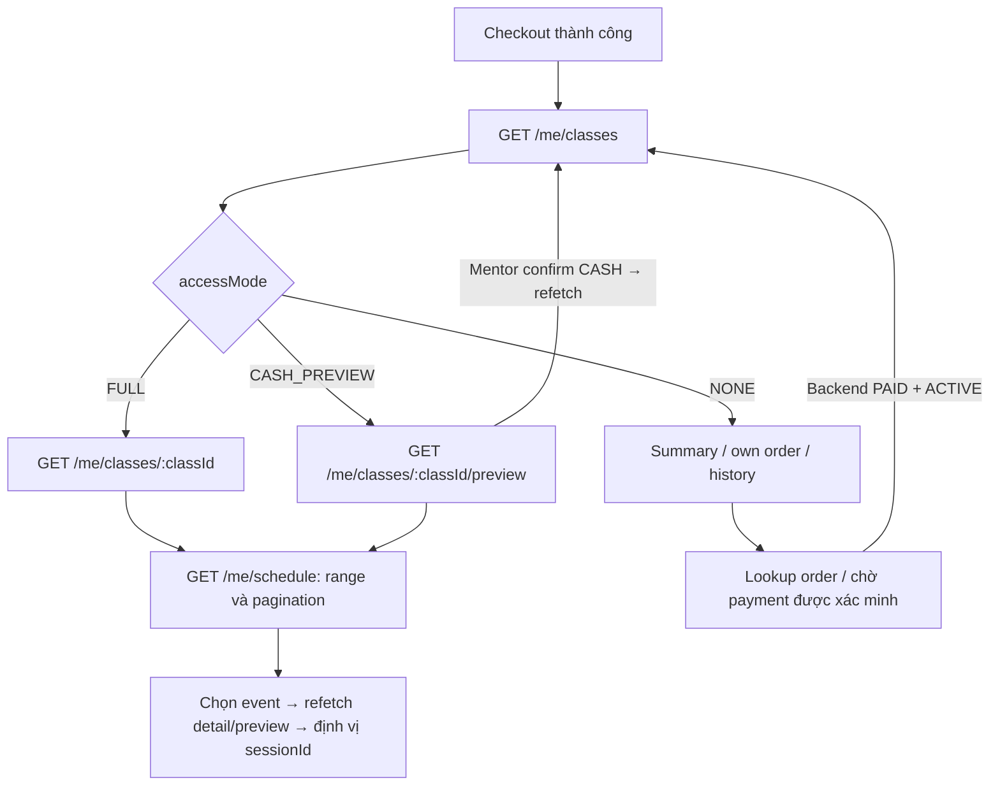

# Phase 2.3 — Flow Student: My Classes và lịch cá nhân

Cập nhật: **2026-10-10**. Đã đối chiếu controller, DTO, service và test trong checkout.
Các API đã implement; evidence local nằm trong progress. Chưa xác minh release/VPS
trong lượt tài liệu này.

API chi tiết: [PHASE_2_3_flow-api-breakdown.md](PHASE_2_3_flow-api-breakdown.md).
Liên hệ Materials/Files: [Flow 2.3 → 3.2](PHASE_2_3_TO_3_2_FLOW.md).
Contract: [FE Phase 2.3](../PHASE_2_3_FE_CONTRACT.md).
Tiến độ: [Progress 2.3](../progress/phase%202/PHASE_2_3_PROGRESS.md).

## Luồng chính

1. Student đăng nhập, chọn Class và checkout theo Phase 2/2.2.
2. FE gọi `GET /api/v1/me/classes` khi checkout thành công hoặc mở “Lớp của tôi”.
   Nguồn danh sách là enrollment của người đăng nhập; một dòng ứng với một
   `enrollmentId`. Một order có thể tạo nhiều dòng cho nhiều lớp.
3. FE chọn endpoint theo `accessMode` của dòng:
   - `FULL`: mở `GET /api/v1/me/classes/:classId`.
   - `CASH_PREVIEW`: mở `GET /api/v1/me/classes/:classId/preview`.
   - `NONE`: hiển thị summary/lịch sử/trạng thái đơn; không tự mở private detail.
4. Calendar gọi `GET /api/v1/me/schedule?from=…&to=…`, lấy đủ các trang của range.
   Chỉ lớp có FULL/CASH_PREVIEW được đưa vào lịch; mỗi event có `sessionId`,
   `classUnitId`, `classId`, `enrollmentId` và `accessMode`.
5. Bấm event → gọi lại detail/preview rồi định vị `sessionId` trong
   `units[].sessions[]`. Calendar không trả meeting URL; Session CANCELLED có nhãn
   hủy và không mời tham gia. Không có session detail endpoint riêng trong 2.3.

## Trạng thái và nhánh cần xử lý

| Trạng thái | My Classes | Detail/lịch |
|---|---|---|
| Enrollment ACTIVE, Class không CANCELLED, chuỗi order hợp lệ | FULL, current | Full detail và lịch |
| CASH hold PENDING_PAYMENT, own order PENDING, `expiresAt > asOf` | CASH_PREVIEW, current | Preview title/timetable/room và lịch; không meeting URL |
| PAYOS hold còn hạn, order PENDING | NONE, current | Summary/own order; không private detail/lịch |
| Enrollment COMPLETED | NONE, current | Summary; chưa cấp lại detail/lịch |
| Hold quá hạn hoặc order đóng | NONE, history | Không preview/lịch dù expiry worker chưa persist |
| Enrollment CANCELLED | NONE, history | Không private detail/lịch |
| Class CANCELLED | NONE; view theo enrollment | Không private detail/lịch |
| Chuỗi enrollment/order sai hoặc pending hold với order PAID | NONE, history | Fail closed, STATE_MISMATCH |

Ma trận chi tiết/ưu tiên reason nằm trong contract và access evaluator. Các access
hint chỉ có hiệu lực tại `asOf`; endpoint detail/preview kiểm quyền lại khi gọi.

- Return URL PayOS không xác nhận quyền học. FE lookup/poll own order theo contract
  Phase 2; chỉ sau backend PAID mới refetch list/lịch để nhận trạng thái mới.
- CASH confirm đổi preview → FULL. Preview cũ có thể trả 403; FE refetch list rồi
  chuyển endpoint phù hợp, không coi đây là mất lớp.
- Quá hạn tại `expiresAt <= asOf` mất preview/lịch ngay khi đọc. Checkout lại sau
  hủy hold có enrollment mới; dùng enrollmentId làm key, không gộp với lịch sử cũ.
- `order.requiresReview=true`: hiển thị đang đối soát; không mời trả lần nữa.
- GET không tạo payment link, không settle/expire, không ghi enrollment/progress.
  Đổi giờ/hủy Session có sẵn phản ánh khi refetch; chưa có workflow nghỉ/dạy bù.

## UI và tích hợp Phase 3

- List/calendar có loading, empty, error và session-expired; filter rỗng là 200,
  không phải lỗi. Đổi range/filter phải reset page và bỏ response cũ không còn khớp.
- Request BE dùng cookie với `credentials: 'include'`. Cache UI theo user;
  xóa khi logout/đổi tài khoản. Backend trả `Cache-Control: private, no-store`.
- Refetch sau checkout, CASH confirm, payment PAID và khi focus. Nếu poll payment,
  dùng giới hạn/backoff và dừng khi order kết thúc, lỗi quyền hoặc rời màn hình.
  API 2.3 không thêm websocket hoặc subscription.
- FULL chỉ cho detail/timetable hiện có; không bảo đảm Material được đọc/tải.
  Phase 3 kiểm ACTIVE, unit release, approval/publication và file READY riêng.
  CASH preview không chứa nội dung/file; Materials CRUD/download vẫn thuộc 3.3/3.4.

## Kiểm chứng và phần còn lại

- Evidence trước lượt này: full `pnpm check` **243/243** và HTTP **20/20** pass sau
  đồng bộ dev; riêng PostgreSQL Phase 2.3 **6/6**. Đây là kết quả local, provider fake.
- Còn query-plan review trên fixture lớn, coverage PayOS settlement → list/lịch
  và staging/VPS smoke trước nghiệm thu toàn phase. Không có bằng chứng live từ
  các test này.
- 2026-10-10: Review progress và API flow, sửa trạng thái 2.3 trong flow tổng hợp,
  tạo flow/breakdown riêng và liên kết contract/progress. Chỉ sửa tài liệu, không
  đổi API hoặc chạy lại runtime tests/migration/deploy.

## Nguồn source

- [My Classes controller](../../src/modules/student-learning/controllers/my-classes.controller.ts)
- [Schedule controller](../../src/modules/student-learning/controllers/my-schedule.controller.ts)
- [Access evaluator](../../src/modules/student-learning/domain/learning-access.ts)
- [Integration tests](../../test/integration/phase23-my-classes-schedule.spec.ts)
- [HTTP tests](../../test/http/phase22-payments.spec.ts)
