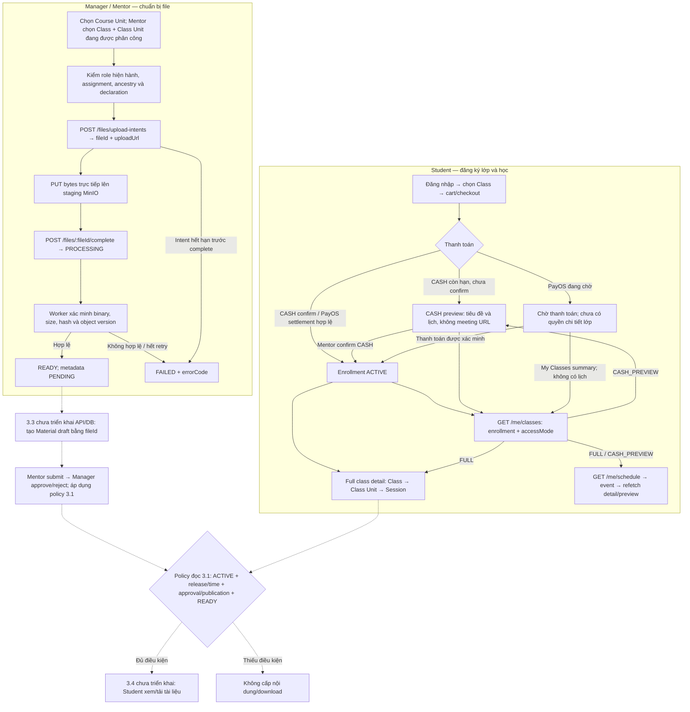
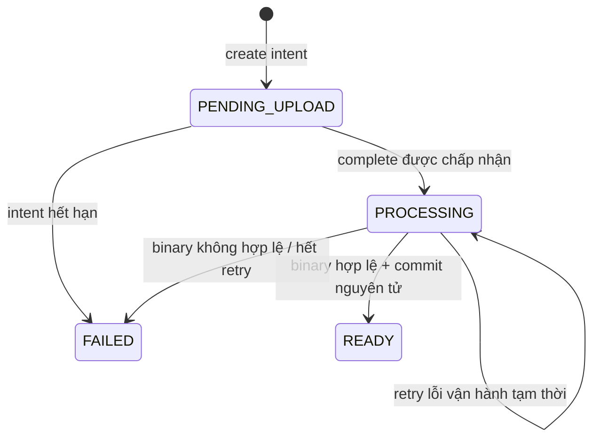

# Flow Phase 2.3 → 3.1 → 3.2

Đối chiếu source và progress trong checkout hiện tại ngày 2026-10-10.
“Đã code” bên dưới chỉ nói về repo; không khẳng định đã deploy hoặc bật trên VPS.

FE tích hợp upload: [Flow 3.2](PHASE_3_2_FLOW.md) và
[API breakdown 3.2](PHASE_3_2_flow-api-breakdown.md).
FE tích hợp My Classes/lịch: [Flow 2.3](PHASE_2_3_FLOW.md) và
[API breakdown 2.3](PHASE_2_3_flow-api-breakdown.md).

## 1. Mỗi phase cung cấp gì?

| Phase | Mục tiêu | Đã có trong checkout này | Phần còn thiếu |
|---|---|---|---|
| 2.3 | Student tìm lớp đã đăng ký, xem detail và lịch cá nhân | StudentLearningModule, collection My Classes, lịch nhiều lớp, DTO access context, full detail/CASH preview; suite local pass | Query-plan review trên fixture lớn, coverage PayOS settlement → list/lịch và staging/VPS smoke |
| 3.1 | Quy định ai được tạo, sửa, duyệt và đọc tài liệu | Role MANAGER + migration; MaterialsModule/MaterialPolicyService; context providers; domain review/revision/access và test | Material entity, DB persistence, HTTP CRUD/review và Student download thuộc các slice sau |
| 3.2 | Upload file private và xác minh nội dung thực | Files API, private/versioned MinIO adapter, file/job/metadata tables, validation worker, retry/lease/reference locks và test | Material CRUD/review ở 3.3; Student đọc/tải ở 3.4; metadata extraction/cleanup ở 3.5; rollout/tích hợp ở 3.6 |

Hai nhánh Student và Manager/Mentor làm việc độc lập, sau này gặp nhau ở Material.
2.3 cung cấp classId/classUnitId/sessionId để điều hướng; 3.1 kiểm quyền nội dung;
3.2 cung cấp fileId đã xác minh. Một file READY chưa trở thành Material được phép đọc.

## 2. Flow tổng thể

Nét liền: flow nền tảng/API hiện có. Nét đứt: phần chưa có HTTP/persistence trong checkout này.
Policy 3.1 đã code nhưng việc gắn policy vào Material API nằm ở phase sau.

## 3. API hiện có và dự kiến

Tất cả backend routes dưới prefix `/api/v1`. PUT uploadUrl là request tới MinIO,
không phải API upload multipart của NestJS.

| Method + route | Actor | Đầu ra / mục đích | Trạng thái |
|---|---|---|---|
| `POST /me/cart/items` | Student | Thêm Class vào cart | Có, nền tảng Phase 2 |
| `POST /me/cart/checkout` | Student | Tạo order, hold và enrollment pending | Có, nền tảng Phase 2 |
| `POST /me/orders/:orderId/payments/payos` | Student | Tạo/tái dùng payment link theo policy hiện hành | Có, nền tảng 2.2 |
| `POST /payment-callbacks/payos` | Provider callback | Xác minh callback và xử lý settlement; redirect FE không tự cấp quyền | Có, nền tảng 2.2 |
| `POST /mentor/cash-orders/:orderId/confirm` | Mentor có quyền với order | Xác nhận CASH và kích hoạt enrollment | Có, nền tảng 2.2 |
| `GET /me/classes/:classId` | Student ACTIVE | Full detail, units/sessions/timetable, meeting URL và context enrollment/FULL | Đã code; context bổ sung 2.3 |
| `GET /me/classes/:classId/preview` | Student CASH pending còn hạn | Title/timetable/room + context hold/order/CASH_PREVIEW; không meeting URL | Đã code; context bổ sung 2.3 |
| `GET /me/classes` | Student | Danh sách enrollment, current/history/all, access hints | Đã code 2.3, local DB/HTTP verified |
| `GET /me/schedule?from=…&to=…` | Student | Lịch tổng hợp Session của các lớp có quyền; không meeting URL | Đã code 2.3, local DB/HTTP verified |
| `POST /files/upload-intents` | Manager / Mentor được phân công | Tạo intent; trả fileId, URL PUT và requiredHeaders | Đã code 3.2 |
| `POST /files/:fileId/complete` | Manager / Mentor đủ quyền hiện hành | Enqueue VALIDATE một lần; 202 khi PROCESSING, 200 khi READY | Đã code 3.2 |
| `GET /files/:fileId` | Manager / Mentor đủ quyền hiện hành | Status, errorCode và metadataStatus; không trả download URL | Đã code 3.2 |

**3.1 không thêm một bộ HTTP Material API.** Các hàm createDraft/applyCommand/canRead
đã có ở service/domain, nhưng chưa có controller hay persistence Material.
Contract API trong plan không có nghĩa route đã tồn tại.

## 4. Flow Student của 2.3

1. Student chọn Class và checkout. Order phản ánh giao dịch; Enrollment là nguồn
   quyết định quyền học.
2. CASH pending còn hạn được dùng preview; PayOS pending chưa được full detail.
   Hết hạn/hủy hold không còn quyền preview, dù timer chưa persist expiry.
3. Khi payment được xác minh/confirm đúng, Enrollment chuyển ACTIVE. Student có
   thể gọi full detail nếu Class không CANCELLED.
4. FE gọi My Classes để lấy enrollment và accessMode. FULL mở
   detail; CASH_PREVIEW mở preview; NONE chỉ hiển thị summary/trạng thái phù hợp.
5. Lịch cá nhân chỉ gồm các lớp FULL hoặc CASH_PREVIEW; pending PayOS,
   expired/cancelled, COMPLETED enrollment và Class CANCELLED không được cấp lịch
   private theo contract hiện hành. Collection/list history khác quyền nội dung.
6. Khi bấm buổi học, FE dùng classId để refetch detail/preview và định vị sessionId
   trong units/sessions. Calendar không trả meeting URL.

Các API/DTO ở bước 4–6 **đã implement**. List mặc định pageSize 20, calendar 100,
tối đa 100; lịch yêu cầu range có timezone, `[from, to)` ≤31 ngày. Sau PAID/CASH
confirm, refetch list/lịch; hint tại `asOf` không thay việc kiểm quyền lại ở detail.
FULL không tự mở Material. Xem breakdown 2.3 để tích hợp từng endpoint/lỗi.

## 5. Những rule đã code ở 3.1

- Material thuộc **Course Unit**, có thể gắn Session nếu ancestry khớp. Nội dung
  được chia sẻ giữa các lớp dùng cùng Course Unit; release được kiểm theo lớp đang đọc.
- MANAGER là role riêng. ADMIN không tự có quyền upload/quản lý Materials.
- Mentor được phân công có thể tạo/sửa draft của mình trước lần duyệt đầu tiên,
  submit để Manager duyệt. Mentor không tự approve/publish hoặc sửa nội dung đã
  từng được duyệt; Manager quản lý nội dung chung.
- Domain có CREATE/EDIT/SUBMIT/APPROVE/REJECT/PUBLISH/UNPUBLISH/DELETE, revision
  và audit output. Đây là state transition trong code, chưa ghi Material vào DB.
- APPROVE ghi approval đúng revision và publishedAt hiện tại; availableAt/release
  vẫn có thể trì hoãn quyền đọc. REJECT ghi lý do. EDIT tăng revision, chuyển về
  DRAFT và thu hồi approval/publication cũ.
- Student đọc cần đủ: user active, Enrollment ACTIVE, Class không CANCELLED,
  Class Unit OPEN hoặc COMPLETED và đã tới unlockAt, Material chưa xóa, approval
  đúng revision, đã publish/đến thời điểm cho phép và file READY đúng Course Unit.
- Enrollment COMPLETED không tự có quyền đọc. Session CANCELLED không tự thu hồi
  tài liệu chính thuộc Course Unit.

Ví dụ: cùng một Course Unit có tài liệu chung cho lớp A/B. A đã mở unit, B còn
LOCKED: Student A có thể đạt policy đọc; Student B vẫn bị chặn dù file là READY.

## 6. Flow upload 3.2 có thể gọi ngay khi storage được cấu hình

1. Manager/Mentor gửi `POST /api/v1/files/upload-intents` với `courseUnitId`,
   `originalFilename`, `declaredMimeType`, `declaredSizeBytes`. Mentor bắt buộc gửi
   cả `classId` và `classUnitId`; Manager có thể bỏ cả hai, nhưng nếu gửi phải khớp.
2. Backend kiểm role active/assignment/ancestry, filename/MIME/size và quota;
   tạo file PENDING_UPLOAD. Response gồm fileId, uploadUrl, requiredHeaders,
   uploadUrlExpiresAt và intentExpiresAt.
3. FE PUT bytes trực tiếp tới uploadUrl, dùng đúng requiredHeaders. Không gửi
   cookie đăng nhập của API tới MinIO.
4. FE gọi `POST /api/v1/files/:fileId/complete` với `{}`. Backend kiểm quyền lại,
   chuyển PROCESSING và tạo VALIDATE job bền vững trong PostgreSQL.
5. Worker khóa version staging, đọc bytes, kiểm kích thước/binary/hash, copy tới
   final private object và commit READY nguyên tử cùng metadata PENDING/EXTRACT job.
   EXTRACT chưa được thực thi trong 3.2.
6. FE poll `GET /api/v1/files/:fileId`: READY có thể bàn giao fileId cho flow
   Material ở 3.3; FAILED hiển thị errorCode và tạo intent mới nếu upload lại.
   PROCESSING tiếp tục chờ; lỗi storage tạm thời retry hữu hạn.

Worker có lease/heartbeat/fencing để instance cũ không ghi đè kết quả; complete
concurrent không tạo job trùng. Overwrite staging sau complete không đổi phiên bản
đã pin. READY reference cần transaction/lock khi phase sau gắn file vào Material.

Formats: PDF/PNG/JPG/DOCX/PPTX/XLSX/MP3/MP4 và các text/source được allowlist.
Giới hạn thường 25 MiB; MP4 200 MiB. Không chỉ tin extension/MIME client khai báo.

## 7. Điều kiện chạy local, CI và VPS

- API Files cần `MINIO_ENABLED=true`, endpoint/credentials/bucket private có versioning.
- Worker tự chạy cần cả `MINIO_ENABLED=true` và `FILE_JOB_ENABLED=true`.
  Tắt worker không tự xử lý file PROCESSING.
- Linux validator dùng `/usr/bin/ffprobe`; Docker runtime đã cài `ffmpeg`.
  Workflow Check có bước cài dependency tương ứng trên runner.
- Redis không bắt buộc cho jobs của 3.2; job truth nằm trong PostgreSQL.
- VPS đang để `MINIO_ENABLED=false` theo thông tin user: storage bị tắt;
  các request tạo/complete/status upload đủ quyền bị từ chối với HTTP 503,
  code `FILE_STORAGE_DISABLED`.
  Có source API không đồng nghĩa đã có hành trình upload dùng được trên VPS.
- CI dùng MinIO fixture riêng; không phụ thuộc flag/MinIO của VPS.
- Muốn Student thực sự đọc/tải tài liệu vẫn cần 3.3 + 3.4 và cấu hình/rollout tương ứng.

## 8. Nhật ký đối chiếu

- 2026-10-10: Cập nhật phần 2.3 từ “kế hoạch/chưa triển khai” thành API đã code,
  sửa diagram/route table/Student flow và liên kết flow/breakdown riêng.
  Progress đã có evidence local: full check 243/243, HTTP 20/20 sau ghép dev;
  riêng DB 2.3 6/6. Đây là evidence lượt trước, không chạy lại runtime tests trong
  lượt tài liệu; chưa xác minh release/VPS hoặc thanh toán thật.

## 9. Nguồn đối chiếu

- [Flow 2.3](PHASE_2_3_FLOW.md)
- [API breakdown 2.3](PHASE_2_3_flow-api-breakdown.md)
- [Contract FE 2.3](../PHASE_2_3_FE_CONTRACT.md)
- [Progress 2.3](../progress/phase%202/PHASE_2_3_PROGRESS.md)
- [Plan 2.3](../implement_phase/phase2/PHASE_2_3_MY_CLASSES_SCHEDULE.md)
- [Progress 3.1](../progress/phase%203/PHASE_3_1_PROGRESS.md)
- [Progress 3.2](../progress/phase%203/PHASE_3_2_PROGRESS.md)
- [Runbook Files](../PHASE_3_2_FILES_RUNBOOK.md)
- [Student full detail controller](../../src/modules/classes/controllers/student-classes.controller.ts)
- [CASH preview/confirm controller](../../src/modules/payments/controllers/cash-payments.controller.ts)
- [Files controller](../../src/modules/files/controllers/files.controller.ts)
- [Material policy facade](../../src/modules/materials/services/material-policy.service.ts)
- [Material read policy](../../src/modules/materials/domain/material-access.ts)
- [Material review transitions](../../src/modules/materials/domain/material-review.ts)
- [Upload authorization](../../src/modules/files/services/file-upload-policy.service.ts)
- [File worker](../../src/modules/files/services/file-processing.worker.ts)
