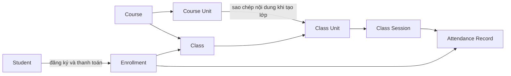
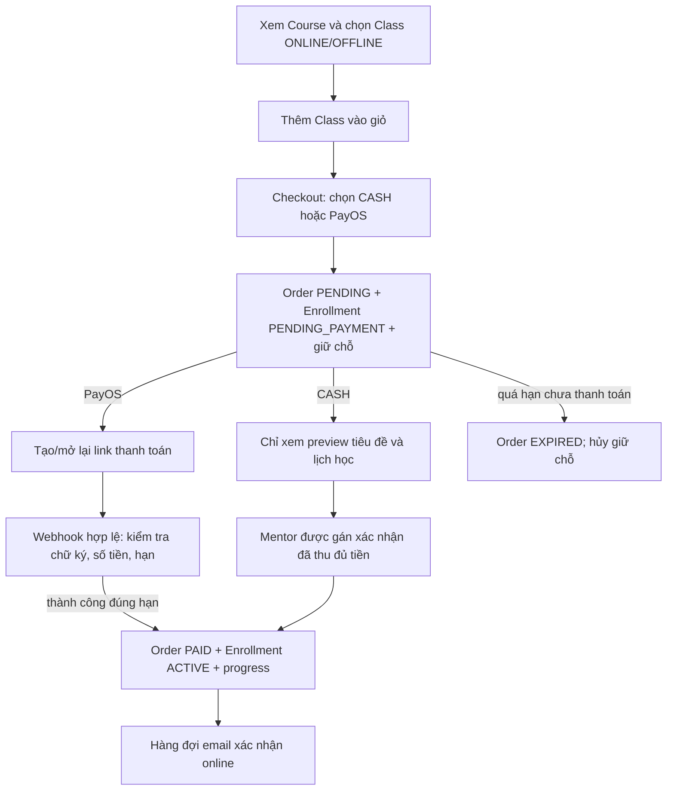
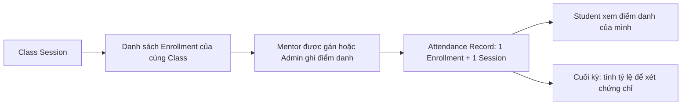

# Course flow — bản để kiểm tra trước Phase 3

> Trạng thái: **D1–D6 Phase 3 đã duyệt; các quyết định attendance/bù/chứng chỉ còn mở**.
> Nguồn nghiệp vụ và mô hình dữ liệu: [`Flow.txt`](./Flow.txt), [`usecase-course.drawio`](./usecase-course.drawio) và [`mindy_center_full.dbml`](./mindy_center_full.dbml).  
> Nguồn quyết định triển khai hiện hành: [`CORE_BUSINESS_LOGIC.md`](../docs/CORE_BUSINESS_LOGIC.md), [`PHASE_2_FE_CONTRACT.md`](../docs/PHASE_2_FE_CONTRACT.md), [`Progress.md`](../docs/progress/Progress.md).  
> Tài liệu này mô tả **flow mong muốn**; các mục ghi “chưa triển khai” không phải API/tính năng đã có.

> Tiếp nối 2026-10-09: đã lập [kế hoạch Phase 3 File + Materials](../docs/implement_phase/PHASE_3_FILES_MATERIALS.md)
> từ flow này, DBML và use case. User đã duyệt D1–D6 tại
> [Phase 3.1](../docs/implement_phase/PHASE_3_1_POLICY_CONTRACT.md): Material chính
> thuộc Course Unit 1–N, shared giữa các lớp; Manager quản lý/sửa/duyệt, Mentor
> upload chờ duyệt; ACTIVE + unit release + approval/publication mới đọc được.
> Role MANAGER được bổ sung bằng migration mới; policy/contract/providers 3.1 đã
> code và test local. Upload/storage/review/material HTTP API chưa có.

## 1. Khái niệm và quan hệ

| Khái niệm | Vai trò trong flow |
|---|---|
| **Course** | Khóa học mẫu do Admin quản lý: thông tin công khai, giá và danh sách Course Unit. Course không có lịch dạy và tự nó không cấp quyền học. |
| **Course Unit** | Nội dung/chương học có thứ tự trong Course. |
| **Class** | Lớp mở từ một Course, có hình thức ONLINE/OFFLINE, mentor, sức chứa, thời gian và trạng thái. Student đăng ký **Class**. |
| **Class Unit** | Bản nội dung của Course Unit được đưa vào Class khi tạo lớp; thứ tự/trạng thái của lớp có thể được quản lý độc lập. |
| **Class Session** | Buổi học có lịch cụ thể thuộc một Class Unit. DBML gắn điểm danh, assignment và board trực tiếp với Session; materials hiện gắn với Course Unit. |
| **Enrollment** | Quan hệ Student–Class. Lúc checkout là giữ chỗ `PENDING_PAYMENT`; sau khi thanh toán hợp lệ là `ACTIVE`. |
| **Attendance Record** | Kết quả điểm danh của một Enrollment tại một Class Session. DBML giới hạn một bản ghi cho mỗi cặp `(enrollment_id, class_session_id)`. |

Quan hệ chính:

**Cách hiểu đang dùng:** “Import class from course-unit” trong sơ đồ nghĩa là khi Admin tạo Class từ Course, hệ thống đưa các Course Unit hiện có vào Class Unit. Flow này không thêm một bước duyệt thủ công để Student được vào Course Unit sau khi thanh toán; enrollment được kích hoạt tự động. Nếu ý định là chọn từng Course Unit để mở một Class riêng, cần sửa quy tắc trước khi làm tiếp.

## 2. Vai trò

- **Student:** tìm khóa/lớp, đăng ký, thanh toán, xem lịch và nội dung theo quyền, làm bài, nhận phản hồi/chứng chỉ.
- **Mentor:** đăng ký khả năng dạy, nhận hoặc đề nghị slot, xem lịch, quản lý buổi học của lớp được phân công, xác nhận tiền mặt, chấm bài và phản hồi.
- **Admin:** quản lý Course/Unit/Class, phân công mentor, duyệt thay đổi lịch, hỗ trợ học viên và xem giao dịch.
- **Email Service:** gửi xác nhận thanh toán online và thông báo đổi buổi học theo sự kiện nghiệp vụ.
- **System/Timer:** xử lý hết hạn đơn/giữ chỗ; về sau xét điều kiện và tạo chứng chỉ cuối kỳ.

Role **MANAGER** riêng được user yêu cầu bổ sung ngày 2026-10-09 để quản lý/sửa/
duyệt tài liệu chính. Mentor được upload chờ Manager duyệt. Admin vẫn quản trị
users/Course/Class/payment theo baseline; Manager không tự kế thừa các quyền đó.

## 3. Tạo khóa và mở lớp

1. Admin tạo/chọn category, tạo Course ở trạng thái chưa công khai và thêm các Course Unit theo thứ tự.
2. Admin hoàn thiện thông tin rồi kích hoạt Course. Course công khai chỉ xuất hiện khi hợp lệ và có ít nhất một Unit.
3. Admin tạo Class từ Course: chọn ONLINE/OFFLINE, mentor đang hoạt động, sức chứa và khoảng ngày. Hệ thống tạo Class Unit từ các Course Unit trong cùng giao dịch.
4. Admin lập các Class Session, kiểm tra thời gian bắt đầu/kết thúc và lịch mentor; mở Class khi đủ điều kiện.
5. Student có thể xem Course công khai và các Class `OPEN` có thể đăng ký. Các Class đã bắt đầu/kết thúc/hủy vẫn phục vụ trang quản trị hoặc người có quyền, nhưng không còn là lựa chọn mua mặc định.

Vòng đời Class dự kiến: `DRAFT → OPEN → IN_PROGRESS → COMPLETED`, có nhánh `CANCELLED` từ các trạng thái cho phép. Việc chỉnh Course Unit về sau không tự động đổi cấu trúc các Class đã tạo.

## 4. Student đăng ký và thanh toán

### 4.1 Chọn lớp và checkout

- Student có thể xem danh sách Course, chọn Class theo hình thức học rồi thêm vào giỏ. Giá hiển thị trong giỏ chỉ để tham khảo; checkout dùng giá hiện hành do server tính.
- Checkout kiểm tra lại Class đang `OPEN`, sức chứa, việc đã đăng ký/giữ chỗ và giá. Nếu một món không hợp lệ thì không tạo một phần đơn.
- Thanh toán **toàn bộ** số tiền. PayOS tạo một Order cho giỏ; CASH có thể tách thành nhiều Order theo mentor nhận tiền. Mỗi Order có chi tiết/giá chụp tại thời điểm checkout và hạn giữ chỗ.
- Checkout tạo enrollment `PENDING_PAYMENT` để giữ chỗ. Gọi lại checkout khi giỏ trống không tạo thêm Order; Student có thể mở lại Order đang chờ để tiếp tục thanh toán.

### 4.2 PayOS

- Link/QR được tạo sau checkout. Lỗi hoặc timeout ở nhà cung cấp giữ Order `PENDING` để có thể tra cứu và thử lại cùng attempt, không tạo đơn mua trùng.
- Chỉ webhook PayOS đã được xác thực, khớp mã đơn/số tiền và còn hạn mới chuyển Order sang `PAID`, enrollment sang `ACTIVE`, tạo progress cho từng Class Unit trong một giao dịch. Callback lặp không nhân đôi kết quả.
- Trang quay về từ PayOS chỉ **đọc** trạng thái Order từ backend; tham số trên URL không xác nhận thanh toán.
- Thanh toán đến muộn/sai lệch cần Admin đối soát; không tự mở quyền học. Sau khi thành công, email xác nhận online được đưa vào hàng đợi để gửi sau giao dịch.

### 4.3 CASH

- Student được thêm vào Class dưới dạng giữ chỗ nhưng chỉ thấy **tiêu đề Class Unit/Session và thời khóa biểu** để đến lớp offline. Preview không chứa meeting URL, materials, bài tập hoặc nội dung học đầy đủ.
- Chỉ mentor được gán cho Order đó xác nhận đã thu **đủ** tiền, trong hạn. Khi xác nhận, Order thành `PAID`, enrollment thành `ACTIVE` và progress được tạo trong một giao dịch. Thao tác lặp không tạo dữ liệu trùng.
- Flow.txt và sơ đồ yêu cầu Student CASH pending vẫn có group chat/DM mentor. Đây là quyền **dự kiến cho phase Chat**, chưa phải quyền truy cập nội dung học đầy đủ.

### 4.4 Khi đơn hết hạn

Order chưa trả tiền quá hạn chuyển `EXPIRED`; giữ chỗ được hủy và sức chứa được trả lại. Student có thể đăng ký lại nếu Class còn mở/chỗ. Trường hợp tiền thực đã chuyển sau hạn cần xử lý đối soát, không tự kích hoạt lớp.

## 5. Học trong lớp

### 5.1 Mentor và lịch dạy

1. Mentor cập nhật hồ sơ (kinh nghiệm, feedback), môn và thời gian có thể dạy; xem lịch dạy.
2. Có hai cách nhận slot: mentor tự nhận slot đủ điều kiện hoặc Admin phân công. Admin xem log đăng ký và duyệt yêu cầu nhận slot.
3. Mentor cần nghỉ/dạy bù gửi yêu cầu; Admin duyệt. Sau duyệt, chọn slot thay thế trong tuần và email báo Student liên quan trước buổi học theo quy tắc thời hạn cần chốt ở mục 8.

Các bước tự nhận slot, đăng ký nghỉ và duyệt bù là use case trong nguồn, **chưa được coi là API đã có**.

Trong Phase 2, mentor cần màn hình **lớp được phân công → học viên của lớp → trạng thái Order** để thu tiền mặt. Danh sách lớp lấy theo mentor đang được gán; danh sách học viên chỉ gồm enrollment còn hiệu lực và có thể lọc `CASH`/`PENDING`. Mỗi học viên hiện `orderId`, nhưng nếu một Order mua nhiều Class cùng mentor thì mentor thu **tổng Order**, xác nhận một lần bằng Order đó. Việc đổi mentor của Class không tự đổi mentor đã chụp trong cash order cũ; quyền xác nhận vẫn theo snapshot của Order.

### 5.2 Class → Unit → Session

Mentor được gán vào Class, mở Class Unit rồi quản lý Session. Class có hình thức **ONLINE** (board/compiler trong buổi học) hoặc **OFFLINE**. Theo sơ đồ, quản lý Session gồm dùng/upload materials, giao homework/assignment và điểm danh. DBML hiện đặt `materials.course_unit_id`, còn assignment/attendance gắn với Session; muốn sở hữu material riêng theo Class Unit hoặc Session phải mở rộng mô hình ở Phase 3. Mentor chấm bài và đưa feedback; Q&A theo Class Unit và group chat theo Class.

Material là tài liệu chính của Course Unit, shared qua các Class Unit tham chiếu
cùng Course Unit. Session link tùy chọn chỉ chỉ định sử dụng; Session còn theo
dõi assignment/Q&A/student code riêng. Manager sửa/duyệt tài liệu chung; Mentor
được upload draft, submit chờ duyệt. File READY không thay Manager approval.

Student xem thời khóa biểu cá nhân, Class Unit/Session và tham gia buổi học theo hình thức đã đăng ký. Sau khi có quyền học đầy đủ, Student xem materials, nộp bài, chạy code, xem điểm danh, điểm/feedback và tham gia Q&A/chat. Nội dung phải được kiểm tra theo enrollment/mentor assignment, không chỉ theo role.

### 5.3 Điểm danh theo buổi học

1. Mentor được gán vào Class mở Session và xem danh sách học viên thuộc Class đó. Kế hoạch core cũng cho phép Admin ghi điểm danh; quyền ghi cụ thể cần được thể hiện rõ ở Phase 4.
2. Người có quyền ghi một trạng thái cho từng học viên/buổi: `PRESENT`, `ABSENT`, `LATE` hoặc `EXCUSED`. DBML có `checked_in_at`, `recorded_by`, `created_at`; nó **chưa** quy định điểm danh tự động khi vào phòng online hay quét mã tại lớp offline.
3. Hệ thống phải kiểm tra Enrollment và Session thuộc **cùng Class** trước khi ghi. Khóa duy nhất `(enrollment_id, class_session_id)` ngăn tạo hai kết quả cho cùng một học viên/buổi; sửa kết quả cũ là thao tác cập nhật có kiểm soát, không thêm bản ghi thứ hai.
4. Student chỉ xem kết quả điểm danh của mình theo từng Session và tổng hợp của Class. CASH pending có thể đến lớp offline theo Flow.txt, nhưng quyền **được ghi điểm danh trước khi Mentor xác nhận tiền** chưa được chốt; không suy ra quyền mở materials/nội dung từ việc có mặt.
5. Buổi nghỉ/dạy bù ở mục 5.1 phải được phản ánh trong lịch Session. Việc giữ hay thay bản ghi điểm danh của buổi cũ, và buổi bù có tính vào mẫu số tỷ lệ hay không, còn cần chốt.

**Đối chiếu DBML:** `attendance_records` liên kết `enrollments`, `class_sessions`, tùy chọn `recorded_by → users`; có unique theo Enrollment/Session và index theo Session/status. Bảng hiện không có `updated_at`, người sửa, lý do sửa hoặc liên kết Session gốc–buổi bù. Nếu Phase 4 cần lịch sử chỉnh sửa hoặc tính buổi bù có chứng cứ, phải bổ sung schema; không mặc định DBML hiện có đã hỗ trợ.

### 5.4 Hoàn thành và chứng chỉ

Cuối kỳ, System dự kiến tự tạo chứng chỉ khi Student đạt **tỷ lệ điểm danh ≥ X%** và **điểm bài tập trung bình ≥ Y**; Student có thể xem/tải chứng chỉ. `X`, `Y`, cách tính `LATE`/`EXCUSED`, buổi bù, thời điểm khóa điểm và cách xử lý bản ghi thiếu chưa được nguồn xác định, nên chưa thể coi đây là rule đã chốt. DBML có dữ liệu điểm danh làm đầu vào nhưng chưa mô tả công thức tỷ lệ hay bảng/chức năng cấp chứng chỉ.

## 6. Quyền đọc theo trạng thái

| Trạng thái của Student với Class | Tiêu đề/lịch cơ bản | Nội dung học, materials, bài tập, meeting URL | Ghi chú |
|---|---|---|---|
| Chưa đăng ký | Thông tin Course/Class công khai | Không | Chỉ Class mở bán được đăng ký. |
| CASH `PENDING_PAYMENT`, còn hạn | Có, qua preview giới hạn | Không | Chat/DM pending được để phase Chat. |
| PayOS `PENDING_PAYMENT` | Chỉ thông tin công khai và Order của mình | Không | Chờ webhook đã xác thực. |
| `ACTIVE` sau thanh toán hợp lệ | Có | Có, theo quyền của lớp/buổi | Materials còn phụ thuộc quy tắc mở khóa được chốt ở Phase 3. |
| Order `EXPIRED`/enrollment bị hủy | Thông tin công khai | Không | Tiền về muộn chuyển đối soát. |

## 7. Ranh giới phase và trạng thái hiện tại

| Phần | Phase | Tình trạng theo tài liệu tiến độ hiện có |
|---|---|---|
| Course/Class catalog, giỏ, checkout, giữ chỗ, PayOS BE, CASH preview/mentor confirm | 2 / 2.2 | Đã triển khai và kiểm tra local; bản sửa tạo QR ngày 2026-10-06 còn cần deploy/kiểm chứng trên VPS. Giao dịch PayOS tiền thật và nghiệm thu live chưa có bằng chứng hoàn tất. |
| File và materials | **3** | D1–D6 đã duyệt: tài liệu chính Course Unit shared, Manager quản lý/review, Mentor upload chờ duyệt. Role Manager có migration mới; upload/review/material API chưa triển khai. |
| Điểm danh và truy vấn vận hành | 4 | DBML đã phác bảng/trạng thái/quan hệ, nhưng chưa có migration/module/API điểm danh. Flow ghi và tính tỷ lệ còn các quyết định ở mục 8. |
| Chat/DM, thông báo | 6 | Chưa triển khai; CASH pending chat là yêu cầu giữ lại. |
| Assignment/chấm bài, board, compiler/judge, chứng chỉ, form tư vấn/gợi ý khóa học | Chưa chốt phase cụ thể | Có trong Flow/use case, không được hiểu là đã hoàn thành. |

**Phạm vi Phase 3 đã duyệt:** upload/lưu trữ file, metadata/lifecycle, Material
chính của Course Unit, Manager quản lý/sửa/duyệt và Mentor upload chờ duyệt;
Student ACTIVE đọc theo release/approval/publication. Không đổi owner sang
Class Unit/Session. Không triển khai điểm danh; giữ quyết định đó cho Phase 4.

## 8. Điểm cần bạn xác nhận trước Phase 3

1. **Đã chốt nơi gắn material:** Course Unit 1–N Material; tài liệu chính shared
   giữa các lớp; Session link optional không đổi owner. Không tự đồng bộ cấu trúc lớp.
2. **Đã chốt quản lý material:** Manager role riêng sửa/quản lý/duyệt; Mentor upload
   và submit chờ Manager duyệt. Approval không phải bước xác nhận thanh toán.
3. **Đã chốt quyền xem:** Student ACTIVE, Class không hủy, Class Unit đã mở/đến giờ,
   Material approved/published/đến giờ, file READY. CASH pending chỉ preview tiêu đề/lịch.
4. **Cách tạo Class:** mỗi Class lấy toàn bộ Course Unit tại thời điểm tạo như hiện tại, hay Admin có thể chọn một phần Course Unit?
5. **Dạy bù:** “trước 1 ngày” là hạn gửi yêu cầu nghỉ, hạn Admin duyệt, hay thời điểm muộn nhất email phải đến Student? Buổi bù có thể ở tuần khác không?
6. **Đối tượng được điểm danh:** chỉ Enrollment `ACTIVE`, hay cả CASH `PENDING_PAYMENT` đang được phép đến lớp offline? Nếu cash hết hạn/hủy sau khi đã dự học, giữ lịch sử điểm danh và tính chứng chỉ ra sao?
7. **Người ghi/sửa điểm danh:** mentor chính của Class, Admin, hay mentor dạy bù cũng được ghi? Cho phép sửa sau khi Session kết thúc trong bao lâu, có bắt buộc lưu người sửa/lý do/lịch sử không?
8. **Cách xác định có mặt:** Mentor đánh dấu thủ công cho ONLINE/OFFLINE, Student tự check-in, hay hệ thống lấy tín hiệu vào phòng? `checked_in_at` chỉ là trường dữ liệu, không tự quyết định cơ chế này.
9. **Buổi bù và kết quả thiếu:** hủy Session cũ rồi tạo Session mới hay đổi lịch cùng Session? Một buổi bù thay thế hay cộng thêm vào tổng số buổi? Nếu Mentor không ghi điểm danh, coi là vắng hay chưa có dữ liệu?
10. **Chứng chỉ:** cần chốt `X`, `Y`, cách tính `LATE`/`EXCUSED`, buổi bù và điểm bài tập. Đây là điều kiện cuối kỳ, chưa ảnh hưởng trực tiếp đến Phase 3.

Nếu các điểm 1–3 được xác nhận, tài liệu này đủ làm nền để viết plan và triển khai Phase 3 File + Materials. Các điểm 4–10 cần giữ để chốt ở phase tương ứng; đặc biệt 6–9 là điều kiện để thiết kế Phase 4 Attendance đúng flow.
